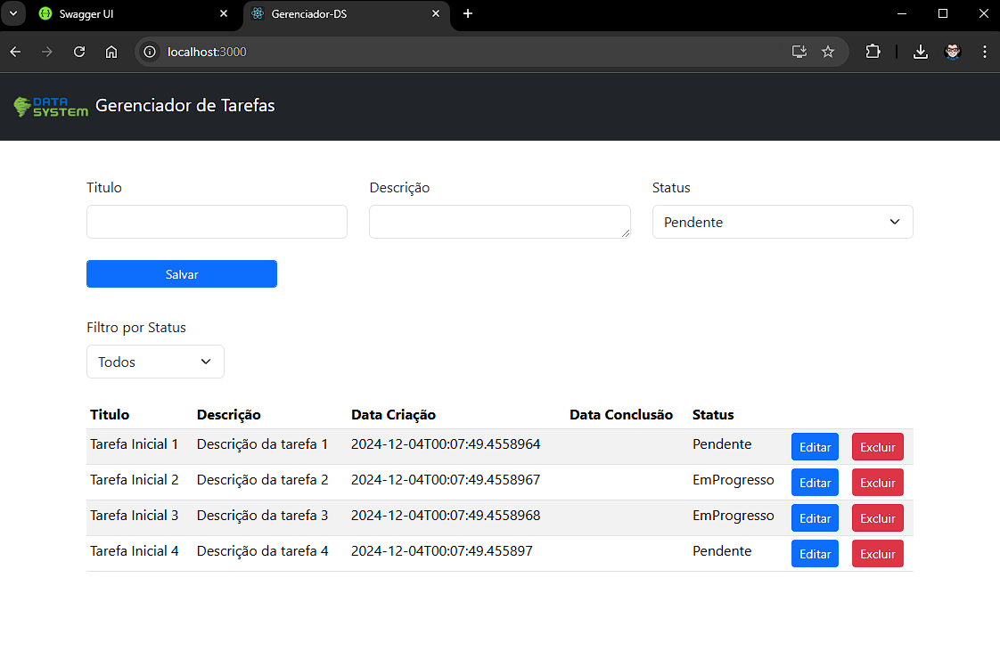

# Front-End - Gerenciador de Tarefas (TODO) 

## Descrição
Este projeto é o Front-End usado na API de Gerenciamento de tarefas

## Funcionalidades

 - Criar uma nova tarefas
 - Carregar todas as tarefas
 - Filtrar tarefas por status
 - Atualizar uma tarefa existente
 - Deletar uma tarefa

## Tecnologias
  - React.js
  - Axios
  - Bootstrap

## Execução/Configuração do Projeto
 - No diretorio **Raiz** do Projeto crie um arquivo **.env** e insira a linha abaixo no mesmo 
    ```bash
    REACT_APP_API_URL=https://localhost:7118/api/v1/tarefas
 - A URL acima vem da API que alimenta este projeto, porem pode mudar este é somente um exemplo
  - Feito isso basta rodar **npm i** para baixar as dependencias do projeto 
  - Em Seguida **npm run start** para inicializar o projeto 
## Screenshots




